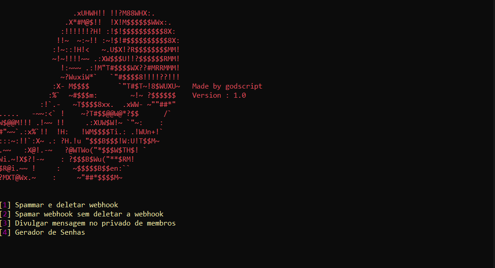

GodScript Tool V1


My program is essentially a dashboard with 4 options for Discord, namely "Spam and delete webhook", "Just spam webhook", "Spread messages in other members' private messages", and "Password generator". The first option allows users to spam and delete webhooks, which are used to send messages to Discord channels. The second option only spams the webhooks without deleting them. The third option lets users send messages to other members privately, which can be used for advertising or other purposes. Finally, the password generator is a tool for generating strong and secure passwords. Overall, your program provides a range of useful tools for Discord users.




## Instalação

Windows :

```
Click in install.bat
```

## Exemplo de uso

Alguns exemplos interessantes e úteis sobre como seu projeto pode ser utilizado. Adicione blocos de códigos e, se necessário, screenshots.

 

## Configuração para Desenvolvimento

Descreva como instalar todas as dependências para desenvolvimento e como rodar um test-suite automatizado de algum tipo. Se necessário, faça isso para múltiplas plataformas.


## Histórico de lançamentos

* 0.1
    * MUDANÇA: Atualização da api e algumas ASCII para design.


## Meta

[Showcase](https://youtu.be/3ui_iIkxOU8)


